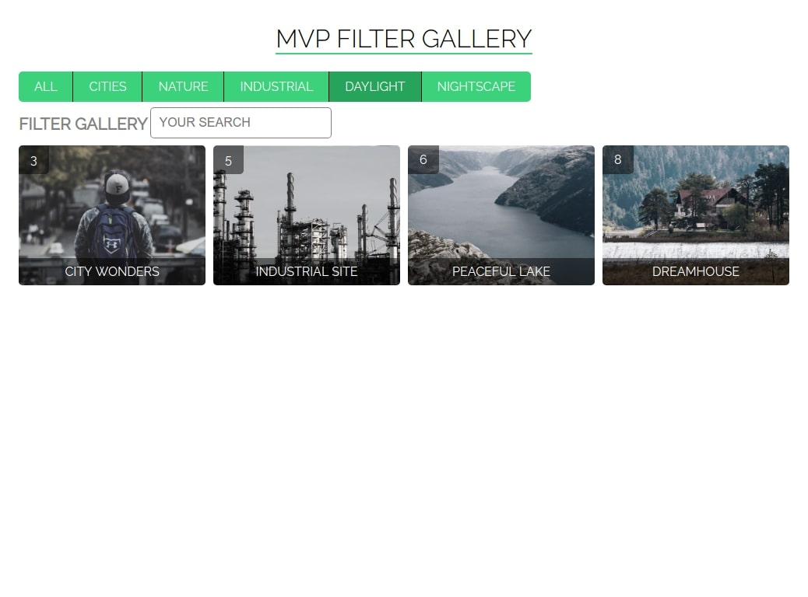
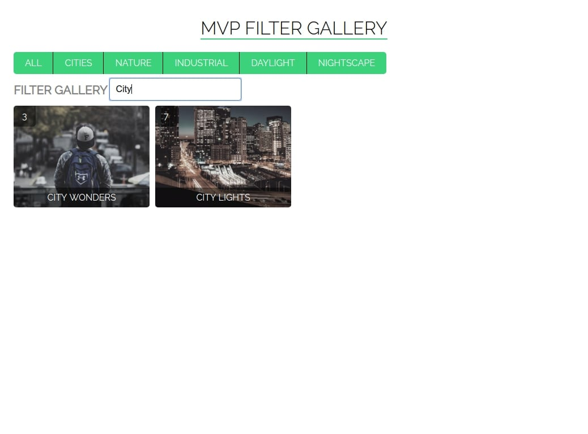

# MVP JS Example Filter Gallery

This ia a simple implementation of the pattern MVP in JavaScript. 

The application does sorting by the selected category which can be selected by clicking on one of the green buttons. You can also use the input field to filter images by name. 

* Data is taken from the file from `files/db/category.json` and `picture.json`
* The application uses the library [jQuery](https://jquery.com/)

You can see example with animation at: 
[live example](https://bukovski.github.io/mvp-js-gallery-pictures/)

