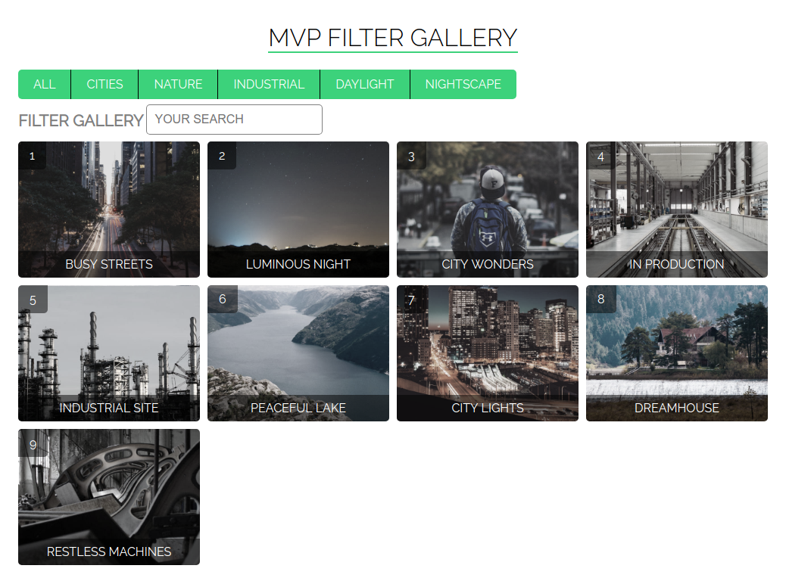
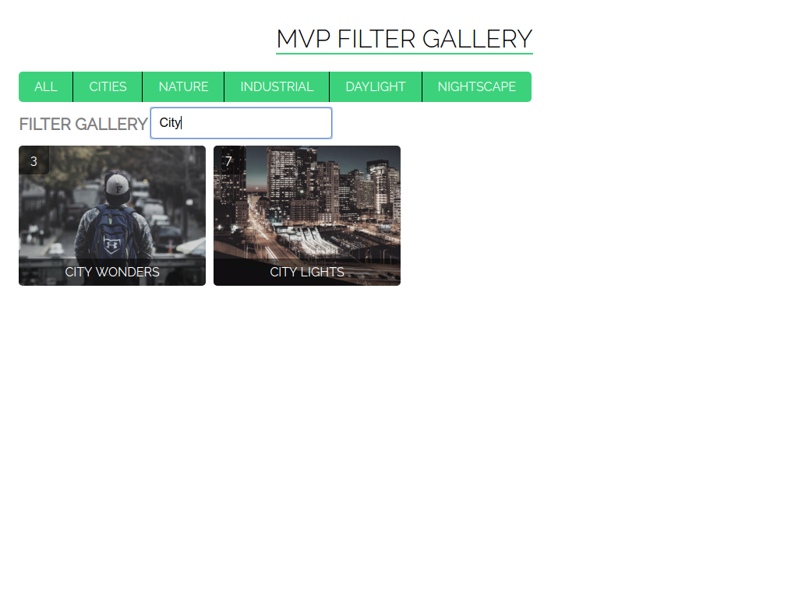

# MVP JS Example Filter Gallery

- a simple implementation of the pattern MVP in JavaScript
- data is taken from the file from files/db/category.json and picture.json
- the application uses the library jquery

	

	

	

